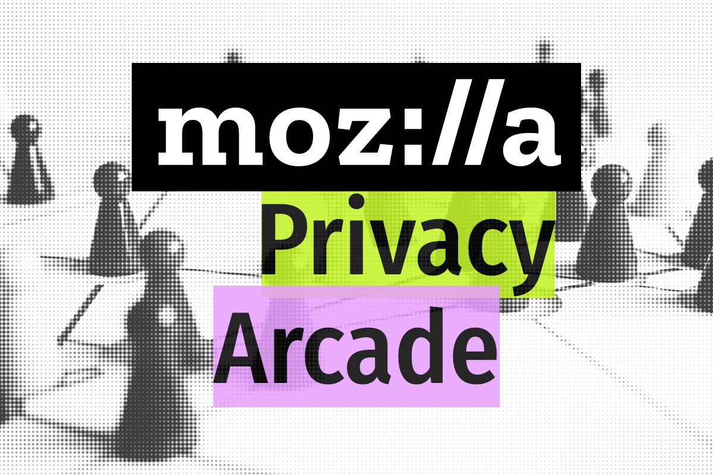

# Mozilla Privacy Arcade, a 2017 Global Sprint Project

**Project Lead:** Chad Sansing

## Description

Online safety isn’t a game, but learning about it can be.

It’s more important than ever to understand the choices we face online about privacy and security. Choosing the right apps, devices, habits, and services to protect ourselves can be difficult.

How can we keep ourselves safe - and how can we keep our data private - when so many businesses and governments want to know everything we do on the Internet?

On a [healthy Internet](https://www.mozilla.org/en-US/internet-health/), privacy doesn’t mean you have something to hide. It means you have the ability to choose who knows where you go and what you do. At Mozilla, we work to provide tools and fight for policies that respect people’s identity and data across the Internet. 

During the 2017 Global Sprint, we invite you to do the same by contributing to the Mozilla Privacy Arcade. 

The Mozilla Privacy Arcade is a set of 4, game-based privacy and security challenges meant to help people learn strong online safety habits in fun, low-risk ways.

## Our Challenges

Click through the link on each Mozilla Privacy Arcade challenge to learn how to get involved:

- [Cryptomancer Challenge.](https://github.com/MozillaFoundation/mpa-cryptomancer-challenge/)
- [Privacy and Security Game Jam Challenge.](https://github.com/MozillaFoundation/mpa-game-jam-challenge/)
- [IoT Escape Room Challenge.](https://github.com/MozillaFoundation/mpa-iot-escape-room-challenge/)
- [Offline Games Challenge.](https://github.com/MozillaFoundation/mpa-offline-games-challenge/)

Each folder will have a copy of our Code of Conduct and Participation Guidelines, as well a README describing its challenge.

You'll also find a "vision" and "open canvas" for each project that illustrate its goals, as well as "personas" that might help you think of people you can recruit to help you with your contributions to these challenges.

Finally, each challenge has a "roadmap" detailing its timeline and deadlines.

## Can I Get To Work Before the Sprint?

Of course. It's fine to begin the sprint with work already in-hand. You should feel free to set up for the sprint however you'd like. You might:

- Make some designs, puzzle, or story ideas for feedback during the sprint.
- Put together a team to begin work now and continue it after the sprint. You can do this online through your network or in our project's issue tracker. You can also recruit a team to work face-to-face in your community.
- Reserve space now to host a "site" or meet-up during the sprint (see more details about hosting a site below).

Just keep in mind that we're asking you to license the work openly so our everyone can use, adapt, and build upon your contributions (see more about licensing below). 

## How To Share Your Work

We’ve set up a repo for the projects you make in response to these challenges. You can check out what the greater Global Sprint community is up to on the [2017 Global Sprint landing page](https://mozilla.github.io/global-sprint/). 

***A repo is a repository - or collection of files - that belong together on GitHub.*** All the files contributed by everyone working on your project will eventually wind up in 1 repo so you can see each other's work, give feedback, and adapt it for yourself or your own communities.

***If you are new to GitHub, it is totally fine to work on another platform,*** like in a Google Document, and to copy and paste your text into an issue or to share a link to your work through an issue. A project or challenge lead will put it into the master "repo" (repository), or collection of work, for you.

Please note that we’re asking all contributors to apply a [Creative Commons-Attribution 4.0](https://creativecommons.org/licenses/by/4.0/) license to whatever non-code contributions they make during the sprint. We’re asking contributors to license code contributions with the [Mozilla Public License 2.0](https://www.mozilla.org/en-US/MPL/2.0/).

However you decide to work or whatever you make, there are lots of ways to contribute:

- Spreading word about the Global Sprint beforehand through your professional and interest-based networks.
- Organizing a team ahead of the sprint and helping it prepare.
- Hosting a site, or meet-up, during the sprint for people in your community so they can work together in person.
- Proposing helpful changes to other contributor's content with "pull requests," or requests to pull new content into older files to update them.
- Crafting new content for the project and contributing it through pull request, issue, or link.
- Sharing resources by filing an issue.
- Sharing feedback by filing an issue.
- GitHub vets, [fork the repo and submit pull requests](https://github.com/acabunoc/mozsprint-repo-template/blob/master/CONTRIBUTING.md#how-to-submit-changes).

There is no wrong way to contribute, and project and challenge leads are here to answer your questions help you get your work into the repo. You should feel free and empowered to share your work before, during, and after the sprint on social media (like through blogs, Facebook, and Twitter), as well.

Thank you for your contributions to the challenges in our Mozilla Privacy Arcade project.

## How To File an Issue on GitHub

GitHub can be challenging for new users. If you experience difficulty with it, you are not alone. We want to help you overcome those challenges or find a way to contribute that works for you.

For this project in the Global Sprint, we can use a feature called the "Issue Tracker" in GitHub to communicate with one another. It's kind of like a shared message board combined with a to-do list. To address an issue to a specific person, you add their name to the issue the same way you would to a tweet, like this for example: @chadsansing would address your GitHub issue to Chad, one of our project leads.

If the Issue Tracker is too difficult to use, contact a project lead. We will work with you and help you find a way to contribute no matter what.

Here are some steps you can take to get started on GitHub if you'd like to try it.

1. First, create an account on [GitHub](https://github.com).

2. Then visit [our repo](https://github.com/mozillafoundation/mozilla-privacy-arcade) or the folder for the challenge you'd like to work on during the sprint.

3. Next, click on the "Issues" tab near the top of the page.

4. Finally, click on the green "New Issue" button to the left of the page. You can then title your issue and add content. Specificity helps.

Before you submit your issue, pick a label for it. You can choose one from the "Labels" dropdown menu to the right of your issue. Pick the label that goes with your Global Sprint project to help people working on the same project pay attention to your issue. We have project labels for:

- mpa-cryptomancer-challenge (gold).
- mpa-game-jam-challenge (purple).
- mpa-iot-escape-room-challenge (green).
- mpa-offline-games-challenge (orange).

We also have labels for site-related news, as well as for finding help and answering questions:

- site-related is light purple.
- help-wanted is red.
- questions are blue.

After you apply all your labels, your issue should have a #mozsprint label, your challenge label, and possibly a site-related, help-wanted, or question label.

If you'd like to learn even more about GitHub, check out the [*GitHub for Collaboration* section](https://mozilla.github.io/open-leadership-training-series/articles/github-for-collaboration/) of Mozilla's [Open Leadership Training Series](https://mozilla.github.io/open-leadership-training-series/articles/github-for-collaboration/).

## How To Host a Site

If you organize a team for the Global Sprint or would like to run a "site" - like a meet-up at a community center or in a learning space or makerspace - visit [this page](https://mozilla.github.io/global-sprint/site-hosts/) to learn how to register your event.

Site leaders receive support from project and challenge leads to help people learn and work together face-to-face. They commit to being on-site from 9AM to 5 PM local time each day so they can:

- Welcome people who come to work in-person.
- Ensure that your site is a safe and friendly working environment for all.
- Help to promote the Global Sprint to your communities and encourage local participation.
- Serve as a point of contact for communicating (updates, progress) with the rest of the Sprint during the event.
- Help to collect data on activities on the Site (number of participants and contributions).

If you would like to host and register a site, let a project lead know how to help. We will make sure you feel well-prepared to host a site.

## When To Sprint

This year’s Global Sprint runs for 48 hours from June 1st, 2017, to June 2nd, 2017. Sprint hours are 9 AM to 5 PM in your local timezone. You can sprint for a few hours, for a day, or for both days. You can contribute to 1 project or several. There is no wrong way to participate in the sprint.

## How To Follow the Sprint Online

We will be curating and sharing your work throughout the sprint, so keep in touch and let us know how things are going at [@MozLearn](https://twitter.com/mozlearn) on Twitter using the hashtag #mozsprint. 

You can also see "Featured Projects" on Mozilla's [Network Pulse](https://www.mozillapulse.org/featured), our resource for sharing exciting events and resources with our community.

## After the Sprint

We’d love to keep up with you after the Global Sprint, as well, to follow the development of your projects. ***We can also help you write a session proposal for this year’s MozFest.***

Questions? File an issue and cc @chadsansing or [email Chad](mailto:chad@mozillafoundation.org).

Let’s go play.
